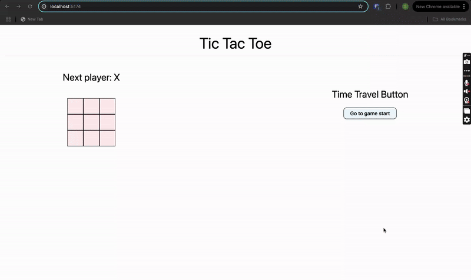

# Tic Tac Toe - React with TypeScript

This is a simple yet engaging implementation of the classic **Tic Tac Toe** game, developed using **React** and **TypeScript**. The game includes a clean UI, state management for game progression, and a "Time Travel" feature to revisit earlier game states.

## Features

- **Interactive Gameplay**: Play Tic Tac Toe with a dynamic interface.
- **Next Player Indicator**: Shows whose turn it is (X or O).
- **Time Travel Button**: Allows players to go back to the start of the game.
- **Responsive Design**: Optimized for desktop and mobile screens.
- **TypeScript Integration**: Strong typing for reliability and maintainability.

## Installation

1. Clone the repository:

   ```bash
   git clone https://github.com/Shravan250/React-with-TypeScript.git
   cd React-with-TypeScript/tictactoe
   ```

2. Install dependencies:

   ```bash
   npm install
   ```

3.Start the development server:

```bash
npm start
```

## How to Play

1. Click on any square to make your move.
2. The game alternates turns between Player X and Player O.
3. Use the **"Time Travel" button** to reset the game to the initial state.

---

## Technologies Used

- **React**: Frontend library for building the UI.
- **TypeScript**: For type safety and code maintainability.
- **Tailwind CSS**: Utility-first framework for styling.
- **CSS**: Styling the components and layout.
- **Node.js** and **npm**: Package management and local server setup.

---

## Preview

The following animation demonstrates the game in action:



---

## Contributing

Feel free to submit issues or fork the project to contribute. Pull requests are always welcome!
